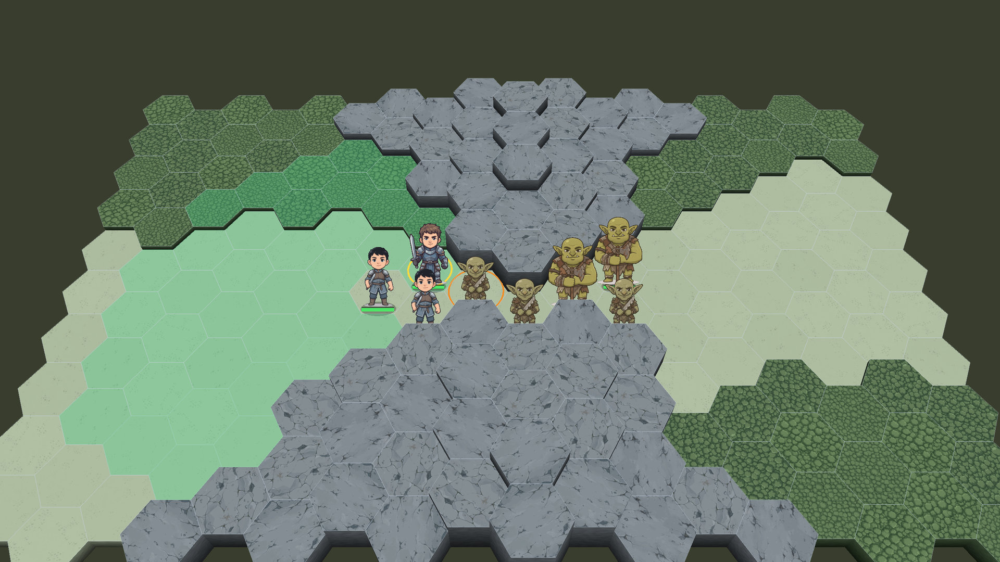
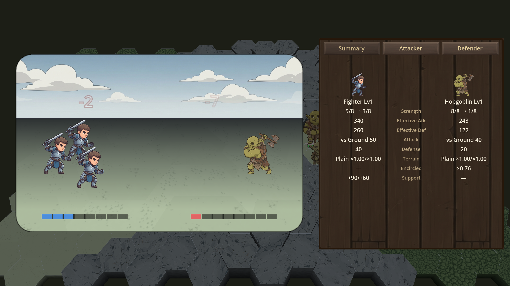
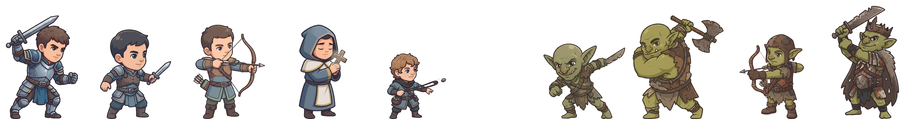

公開:

# devlog #1 — Why Senaris rolls no dice

## 設計

狙い：**「詰将棋（英語圏には chess problem）のようなゲームを作りたかった」という出発点を1つ持ち帰らせる。**乱数なし・生産なしはこの1つの動機から出た引き算として語る——チェスにはサイコロも生産も無い。ページ本文は「no RNG・no production」を言い切るだけで理由を語っていないので、1本目でその裏側を渡す。因果の理屈をこねない（生産なし→乱数なし等の導出はしない。過去案の誤り）。

方針（このシリーズ共通）：**その回のビルドに収録されている要素にしか触れない。**1本目はチュートリアル1（移動・地形・包囲・支援・間接・占領・釣り）の範囲。陣形スキルはチュートリアル2の回で初出しする。

語り口：craftkobo（屋号）。一人称は we を最小限にし、主語は Senaris・the game に寄せる。

話の順序：

1. 名乗り（craftkobo・ファンタジー舞台のヘックス制ターン戦術・体験版を itch に先行して出す）。
2. 出発点：chess problem のように、勝つのに必要なものが全部盤の上に見えているゲームを作りたかった。負けたら盤面を思い返せば理由が分かる。
3. 引き算その1：だからサイコロが無い。同じ攻撃は毎回同じ結果。
4. 引き算その2：だから生産も無い。配られた駒で戦い、失った駒は戻らない。
5. 残るもの＝位置取り：包囲（Encircled）・支援・地形。チュートリアル1で教える範囲だけを挙げる。
6. 期待値の設定：今出す体験版はチュートリアル「The Goblin Raid」＝1ステージ1要素で教える章なので、とても簡単。ただし腕試しに、既出の要素だけで組んだ難易度高めのステージを1本入れてある（実体は feature-81 で作る。ビルドに入っていることが公開の前提）。章ができるたびにビルドへ足していく。
7. 締め：名前の由来＝ラテン語 senarius（6つ一組）＝敵を囲む隣接6ヘックス。次の章ができたらビルドと devlog を更新する。

注意：chess problem の語は「解が1つ」の期待を作りすぎない範囲で使う（marketing.md のタグの節＝Puzzle の期待外れ問題と同じ理屈）。ステージが一本道の詰めではないことは、言い訳がましく否定せず、feels like / closer to の距離感で言う。

画像（3枚。スクリーンショット2枚は UI 英語化が終わるまで撮れないため、ファイルはプレースホルダ）：

- `img/devlog1-1.png` … 2番（出発点）の直後。盤の全景。st3 の実マップで、細道の口をファイター＋ノービス2で塞ぎ、ゴブリンの群れが詰めている。ファイターを選択して移動範囲を表示。「全部盤の上に見えている」の証拠。撮影セット＝`debug-photo/devlog1-1.json`（[debug-stages.md](../../../doc/tech/debug-stages.md)）を `shot_stage --select 7,4` で撮る。
- `img/devlog1-2.png` … 3番（サイコロなし）の直後。戦闘演出シーン＋右の戦闘レポート（英語）。相打ちで両側の損害数が出て、レポートに Encircled ×0.76 など数字の根拠が読める画（一方的な全滅は選ばない＝損耗が残ることの絵）。撮影は `debug-photo/devlog1-2.json` のファイター(7,4)→ホブゴブリン(8,5)を `shot_combat` で連写し、着弾後の枚を選ぶ（確定済み・12枚目）。
- `img/tutorial1_cast.png` … 4番（生産なし）の "the squad you are handed" の直後。チュートリアル1の両陣営を横一列で向かい合わせた絵。左に味方5体（ファイター・ノービス・アーチャー・クレリック・ハーフリング）＝右向き、右に敵4体（ゴブリン・ホブゴブリン・ゴブリンアーチャー・ゴブリンロード）＝左向き。配られる顔ぶれが両軍ともこれで全部、が伝わればよい。既存の combat スロットの絵の組み合わせで作る（新規生成しない）。

用語：画面の語に合わせる（Strength / Encircled / hex）。乱数の語は副題が Deterministic を使うので、本文は no dice / no random rolls / the same attack resolves the same way で言い換える（marketing.md の説明文と同じ使い分け）。

## 本文

Hello — this is craftkobo. Senaris is a turn-based tactics game we are building: hex grid, swords and sorcery, one battle at a time. The demo lives here on itch and will grow chapter by chapter. This is the first devlog, so it should probably explain what kind of game this is trying to be.

Senaris started from one wish: a tactics game that feels like a chess problem. Everything you need to win is sitting on the board, in plain sight. No hidden modifiers, no luck to blame. When you lose, you can look at the final position and trace back the move where it went wrong — and the board will actually give you the answer.

That wish cost us two things most games in this genre keep.

The first is dice. Combat has no random rolls. The same attack, from the same positions, resolves the same way every single time. Nobody whiffs a 95% shot here. If an attack goes badly, it is not bad luck — it is a unit standing where it should not have been, and that is something you can fix.

The second is production. There are no factories and no build queues. Both sides fight the whole battle with the squad they are handed at the start. When a fight costs you Strength, that cost is real — there is no stack of reserves waiting to paper over a bad trade. Committing a unit is a decision, not a transaction.

Take away dice and production, and what remains is position. Surround an enemy and it crumbles — the game calls that state Encircled, and it is the heart of Senaris. Stand allies next to each other and they hold. Terrain tilts every exchange. All of it is on the board, and all of it can be read before you commit to anything.

About the demo: the first build is the opening campaign, "The Goblin Raid". It is a tutorial — each stage teaches one idea — so it is, frankly, very easy. That is by design; it exists to hand you the vocabulary. For anyone who wants an actual fight, the build also includes one extra stage built from the same pieces, tuned to hurt. That one is the real pitch.

One last thing, about the name. "Senaris" comes from the Latin senarius — a set of six. On a hex grid, six is the number of hexes around any unit: a full encirclement. The game's favorite move is hidden in its name.

New stages land in the demo every other week, and there will be a devlog to read along the way.

